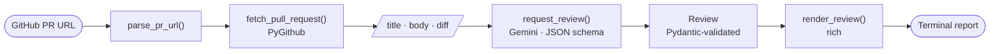
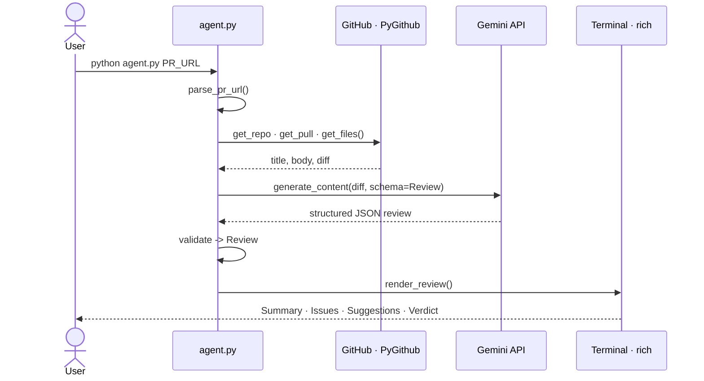

<div align="center">

# 🔍 pr-review-agent

### AI code review for your terminal — point it at a GitHub PR, get a structured, opinionated review powered by Google Gemini.

[](https://www.python.org/)
[](https://ai.google.dev/)
[](https://github.com/Textualize/rich)
[](LICENSE)
[](#-contributing)
[](#%EF%B8%8F-tech-stack)

```bash
python agent.py https://github.com/psf/requests/pull/7489
```

</div>

---

`pr-review-agent` is a focused command-line tool: give it a GitHub pull-request URL and it fetches the title, description, and full diff, asks **Google Gemini** to review the change, and prints a clean, color-coded report — **Summary**, **Issues Found** (severity-tagged, with line references), **Suggestions**, and a final **Verdict**.

The LLM contract is enforced with a **JSON response schema**, so the output is always structured — never a wall of prose to parse.

---

## 📑 Table of Contents

- [Why](#-why)
- [Features](#-features)
- [Example](#-example)
- [How It Works](#%EF%B8%8F-how-it-works)
- [Quick Start](#-quick-start)
- [The Review, Explained](#-the-review-explained)
- [Configuration](#%EF%B8%8F-configuration)
- [Exit Codes](#-exit-codes)
- [Project Structure](#-project-structure)
- [Design Notes](#-design-notes)
- [Troubleshooting](#-troubleshooting)
- [FAQ](#-faq)
- [Roadmap](#-roadmap)
- [Security](#-security)
- [Tech Stack](#%EF%B8%8F-tech-stack)
- [Contributing](#-contributing)
- [License](#-license)

---

## 💡 Why

Code review is the bottleneck on most teams, and the *first pass* — "what does this PR do, and is anything obviously wrong?" — is often the most repetitive part. `pr-review-agent` automates that first pass in one command, so a human reviewer starts from a structured summary and a triaged list of concerns instead of a blank diff. It's a **fast triage tool**, not a replacement for human judgment.

---

## ✨ Features

- **🎯 One command, full review** — `python agent.py <pr-url>` and you're done.
- **🧱 Structured output, guaranteed** — Gemini answers against a Pydantic JSON schema, so you always get the same four sections. No fragile text parsing.
- **🐞 Severity-tagged issues** — each problem is classified (`security` · `bug` · `logic_error` · `other`) and rendered in a color-coded table with `file:line` references.
- **⚖️ Actionable verdict** — `Approve` / `Request Changes` / `Needs Discussion`, with a one-line justification.
- **🎨 Beautiful terminal UI** — panels, tables, and spinners via [`rich`](https://github.com/Textualize/rich).
- **🪟 Cross-platform & crash-resistant** — handles Windows legacy-console encoding (UTF-8) and escapes untrusted text, so a stray `[bold]` or emoji in a diff can't break the render.
- **🔒 Secrets stay local** — API keys live in a git-ignored `.env`; nothing sensitive is ever committed.
- **🧩 Tunable in one place** — model, token budget, and the review prompt all live in `config.py`.

---

## 🎬 Example

```console
$ python agent.py https://github.com/psf/requests/pull/7489
```

```text
──────────────────── PR Review — psf/requests#7489 ────────────────────
FIX: Add RFC 7230 header validation to reject pseudo-headers (fix #6167)

┌──────────────────────────── 📋 Summary ─────────────────────────────┐
│ Introduces requests/validators.py with helpers for validating HTTP   │
│ header names against RFC 7230 (pseudo-headers, control characters).  │
└──────────────────────────────────────────────────────────────────────┘
                          🐞 Issues Found (1)
  Severity      Location   Description
 ──────────────────────────────────────────────────────────────────────
  logic error   N/A:N/A    The PR adds the validators but never wires
                           them into the request flow, so the stated
                           fix for #6167 is incomplete.
┌──────────────────────────── 💡 Suggestions ─────────────────────────┐
│ • Raise a custom requests.exceptions.InvalidHeaderName instead of    │
│   a bare ValueError.                                                  │
│ • Remove the leftover `if __name__ == "__main__":` test block.       │
└──────────────────────────────────────────────────────────────────────┘
┌──────────────────────────────  ⚖️  Verdict ─────────────────────────┐
│ ❌ Request Changes                                                    │
│                                                                       │
│ Validation logic is solid, but it isn't integrated, so the fix is    │
│ incomplete.                                                           │
└──────────────────────────────────────────────────────────────────────┘
```

> *Real output, lightly trimmed. Your terminal gets the full color-coded version.*

---

## 🏗️ How It Works



1. **Parse** the PR URL into `owner / repo / number`.
2. **Fetch** the PR's title, body, and per-file diffs with **PyGithub**.
3. **Review** — the assembled diff is sent to **Gemini**, constrained by a JSON response schema (the `Review` Pydantic model).
4. **Render** the validated result with **rich**.

### Runtime sequence



> 📐 Full **control-flow** (with error paths and exit codes), **data-model**, and **module-map** diagrams live in **[docs/ARCHITECTURE.md](docs/ARCHITECTURE.md)**.

---

## 🚀 Quick Start

### Prerequisites

- **Python 3.9+**
- A **Google Gemini API key** — free at [aistudio.google.com/apikey](https://aistudio.google.com/apikey)
- *(Optional)* a **GitHub token** — required for private repos, recommended for everyone to avoid anonymous rate limits

### Installation

```bash
# Clone
git clone https://github.com/JananiV07/pr-review-agent.git
cd pr-review-agent

# (recommended) create a virtual environment
python -m venv .venv
# Windows:        .venv\Scripts\activate
# macOS / Linux:  source .venv/bin/activate

# Install dependencies
pip install -r requirements.txt
```

### Configuration

Copy the example env file and add your keys:

```bash
cp .env.example .env
```

| Variable         | Required | Description                                                                                          |
| ---------------- | :------: | ---------------------------------------------------------------------------------------------------- |
| `GEMINI_API_KEY` |    ✅     | Your Google Gemini API key — [get one](https://aistudio.google.com/apikey).                          |
| `GITHUB_TOKEN`   |    ⬜     | GitHub PAT. Required for private repos; recommended otherwise — [create one](https://github.com/settings/tokens). |

> `.env` is git-ignored — your keys never leave your machine.

### Usage

```bash
python agent.py https://github.com/<owner>/<repo>/pull/<number>
```

```bash
# Try it on a real public PR
python agent.py https://github.com/psf/requests/pull/7489
```

---

## 🧩 The Review, Explained

| Section            | What it contains                                                                                      |
| ------------------ | ---------------------------------------------------------------------------------------------------- |
| **📋 Summary**      | A neutral, plain-English description of what the PR actually does.                                    |
| **🐞 Issues Found** | Genuine bugs, logic errors, and security concerns — each with a severity and a `file:line` reference. |
| **💡 Suggestions**  | Non-blocking improvements: readability, tests, naming, edge cases.                                    |
| **⚖️ Verdict**      | `Approve`, `Request Changes`, or `Needs Discussion`, plus a one-line rationale.                       |

**Severity levels:** `security` · `bug` · `logic_error` · `other`

---

## ⚙️ Configuration

All tunables live in [`config.py`](config.py):

| Setting          | Default            | Description                                                                       |
| ---------------- | ------------------ | -------------------------------------------------------------------------------- |
| `MODEL`          | `gemini-2.5-flash` | Gemini model. Swap to `gemini-2.5-pro` for deeper reviews of tricky diffs.        |
| `MAX_TOKENS`     | `8192`             | Output-token budget (room for Gemini's reasoning **and** the JSON).              |
| `MAX_DIFF_CHARS` | `200_000`          | Soft ceiling on diff size — larger diffs trigger a warning, not silent truncation. |
| `SYSTEM_PROMPT`  | *(see file)*       | The reviewer persona and field-by-field instructions.                            |

---

## 🔢 Exit Codes

| Code | Meaning                                                                 |
| :--: | ---------------------------------------------------------------------- |
| `0`  | Success — review printed (or the PR had no file changes to review).   |
| `1`  | Error — missing `GEMINI_API_KEY`, invalid URL, GitHub/Gemini API failure, or an unparseable response. |

Each failure prints a clear, color-coded message explaining what went wrong.

---

## 📁 Project Structure

```
pr-review-agent/
├── agent.py          # CLI entry point + all orchestration logic
├── config.py         # Model, token budget, thresholds, system prompt
├── requirements.txt  # Runtime dependencies
├── .env.example      # Template for your secrets (copy to .env)
├── .gitignore        # Keeps .env and caches out of git
├── LICENSE           # MIT
└── README.md
```

---

## 🧠 Design Notes

- **Why a JSON response schema?** Forcing Gemini to fill a Pydantic schema makes the output deterministic in *shape* — every run yields the same four sections, validated before rendering. No regex, no "sometimes it adds a preamble."
- **Diff-only review.** The agent reviews exactly what the diff shows; it does not clone the repo or read surrounding files. That keeps it fast and cheap, at the cost of whole-codebase context.
- **Defensive rendering.** All model- and PR-derived text is escaped before entering `rich` markup, and stdout is reconfigured to UTF-8 — so a diff containing `[/]` or an emoji won't crash the report on any platform.

---

## 🩺 Troubleshooting

| Symptom                                                  | Cause & fix                                                                                  |
| -------------------------------------------------------- | ------------------------------------------------------------------------------------------- |
| `GEMINI_API_KEY is not set`                              | Create a `.env` from `.env.example` and add your key.                                        |
| GitHub error, status **404**                             | The PR/repo doesn't exist, or it's private and your `GITHUB_TOKEN` lacks access.             |
| GitHub error, status **403**                             | Anonymous rate limit hit — add a `GITHUB_TOKEN` to `.env`.                                   |
| `Gemini did not return a parseable review`               | Usually a very large diff exhausting the token budget — raise `MAX_TOKENS` in `config.py`.   |
| Garbled box characters on Windows                        | Already handled (UTF-8) — if it persists, use Windows Terminal or set the console to UTF-8.  |

---

## ❓ FAQ

**Does it post comments back to the GitHub PR?**
No — it's read-only. It fetches the diff and prints the review locally. Posting reviews is on the [roadmap](#-roadmap).

**Does it work on private repositories?**
Yes, if your `GITHUB_TOKEN` has access to them.

**Which model should I use?**
`gemini-2.5-flash` (default) is fast and cheap and handles most PRs well. Switch to `gemini-2.5-pro` in `config.py` for deeper analysis of subtle changes.

**Does my code leave my machine?**
The **diff** is sent to Google's Gemini API for review. Don't run it on code you can't share with a third-party LLM provider. Your API keys stay local in `.env`.

**How much does it cost?**
Gemini has a free tier that covers casual use. Cost scales with diff size; the `MAX_DIFF_CHARS` warning helps you avoid surprise spend on huge PRs.

---

## 🗺️ Roadmap

- [ ] `--post` flag to publish the review as a PR comment
- [ ] `--model` / `--max-tokens` CLI overrides
- [ ] Markdown / JSON output modes (`--format`)
- [ ] Reviewing local `git diff` and uncommitted changes
- [ ] Optional whole-file context for changed files

> Have an idea? [Open an issue](https://github.com/JananiV07/pr-review-agent/issues).

---

## 🔐 Security

- API keys are read from a **git-ignored `.env`** — never hard-code them or paste them into chats/issues.
- **Private-repo diffs are sent to Google's Gemini API** for review.
- Rotate a key immediately if it's ever exposed: [Gemini keys](https://aistudio.google.com/apikey) · [GitHub tokens](https://github.com/settings/tokens).

---

## 🛠️ Tech Stack

| Tool                                                          | Role                                  |
| ------------------------------------------------------------- | ------------------------------------- |
| [google-genai](https://pypi.org/project/google-genai/)        | Gemini API client + structured output |
| [PyGithub](https://pygithub.readthedocs.io/)                  | GitHub REST API client                |
| [rich](https://github.com/Textualize/rich)                    | Terminal formatting                   |
| [pydantic](https://docs.pydantic.dev/)                        | Schema definition & validation        |
| [python-dotenv](https://pypi.org/project/python-dotenv/)      | `.env` loading                        |

---

## 🤝 Contributing

Issues and pull requests are welcome! If you're opening a PR, keep changes focused — and run the agent on it first 😉.

1. Fork the repo & create a branch: `git checkout -b feature/my-change`
2. Make your change and test it on a real PR
3. Open a pull request with a clear description

---

## 📄 License

Released under the [MIT License](LICENSE).

<div align="center">
<sub>Built with PyGithub · Google Gemini · rich</sub>
</div>
