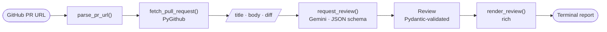
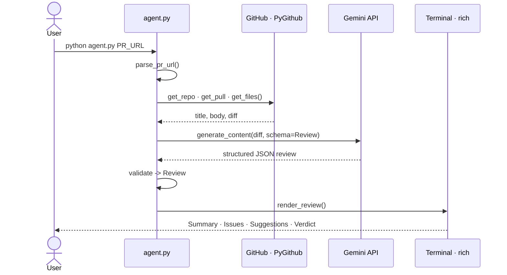
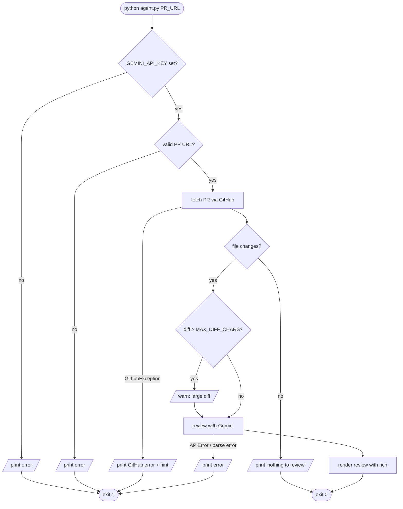
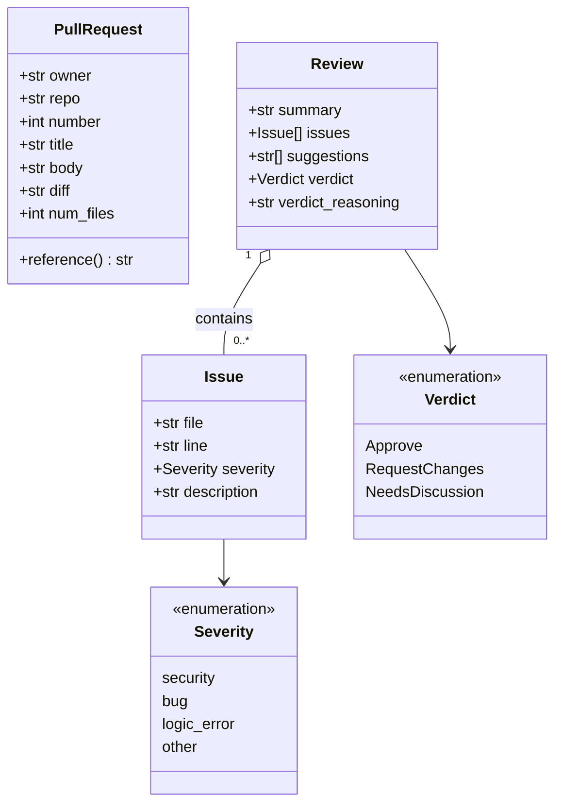
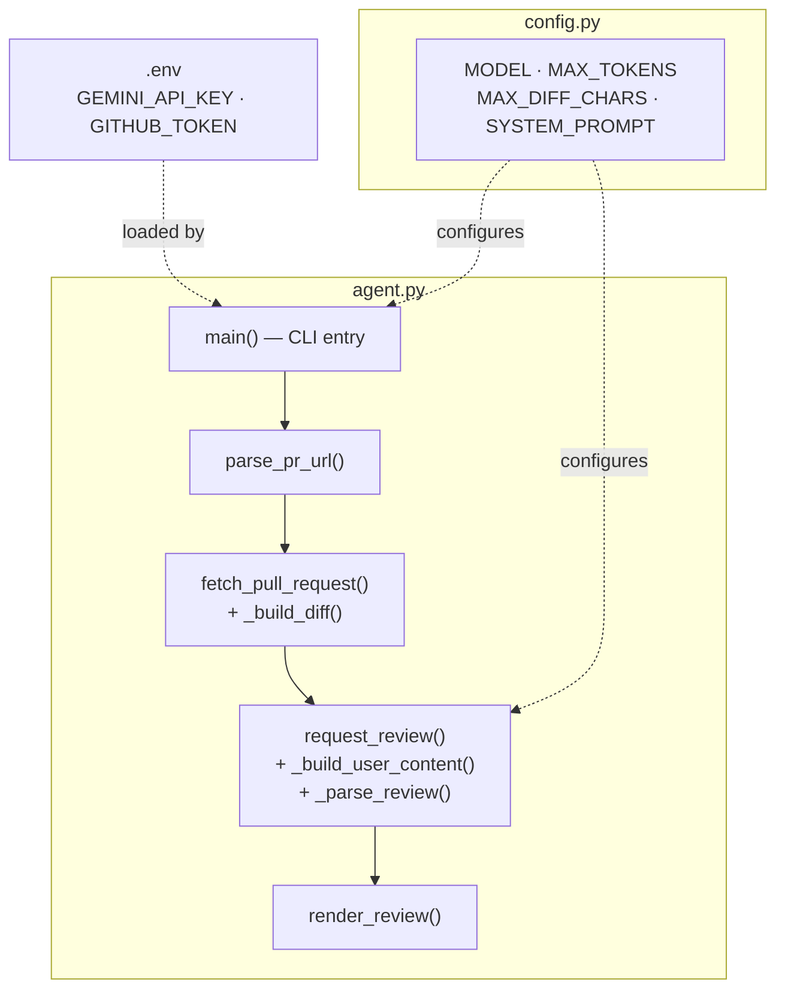

# 🏛️ Architecture

A visual guide to how **pr-review-agent** turns a GitHub pull-request URL into a structured terminal review. All diagrams are [Mermaid](https://mermaid.js.org/) and render natively on GitHub.

- [Pipeline](#pipeline)
- [Runtime Sequence](#runtime-sequence)
- [Control Flow & Exit Codes](#control-flow--exit-codes)
- [Data Model](#data-model)
- [Module Map](#module-map)

---

## Pipeline

The happy path, end to end:

---

## Runtime Sequence

Who talks to whom during a single review run:

---

## Control Flow & Exit Codes

Every branch the CLI can take, including error paths and the resulting exit code:

| Exit code | When |
| :-------: | ---- |
| `0` | Review printed, **or** the PR had no file changes to review. |
| `1` | Missing API key, invalid URL, GitHub error, Gemini error, or unparseable response. |

---

## Data Model

The review contract is a set of Pydantic models. `Review` doubles as the JSON
response schema sent to Gemini **and** the validated object used for rendering —
one source of truth for the output shape.

> **Verdict** values are the literal strings `"Approve"`, `"Request Changes"`, and `"Needs Discussion"` (shown without spaces above for diagram compatibility).

---

## Module Map

How the code is organized and what each piece owns:

---

_Back to the [README](../README.md)._
